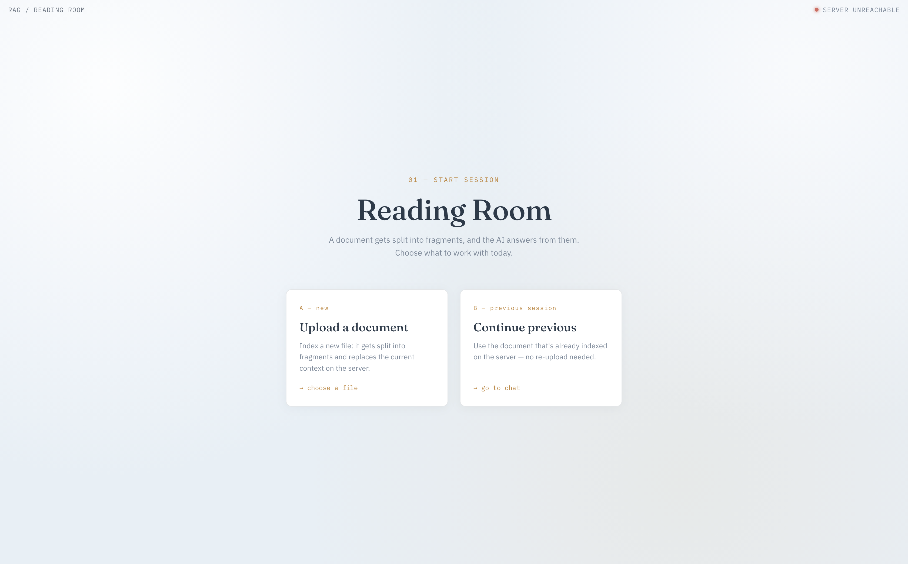
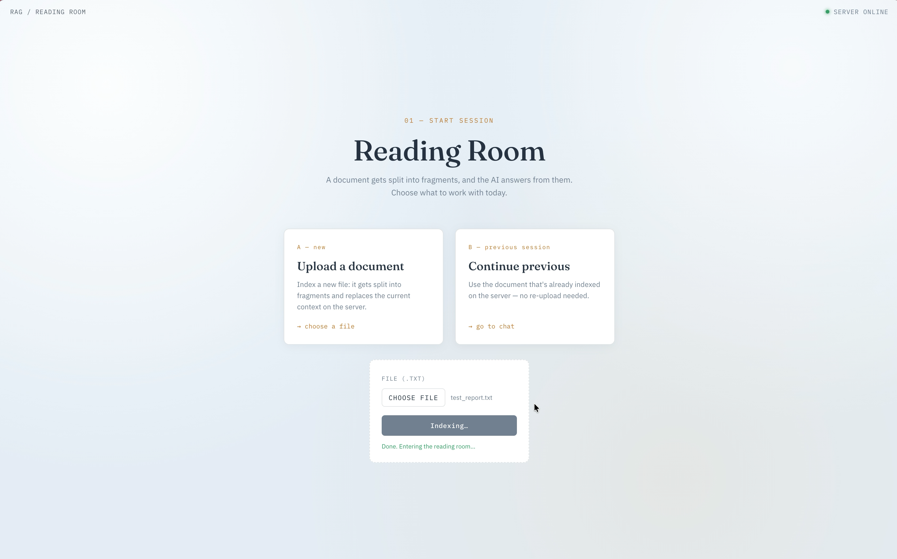
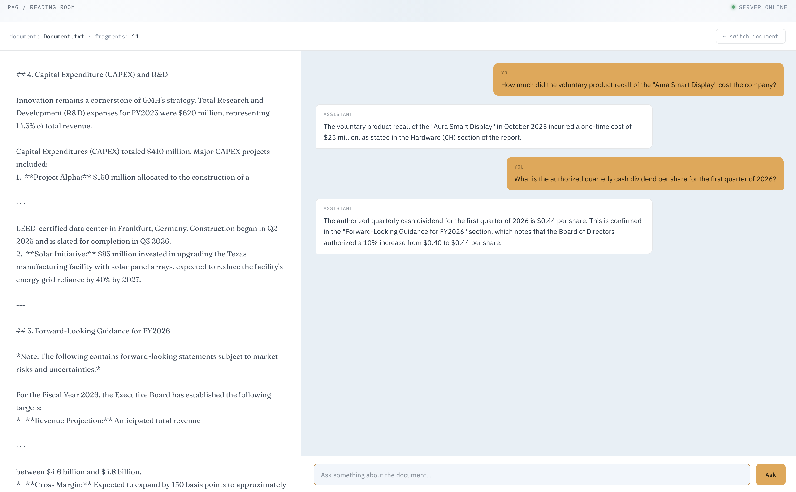
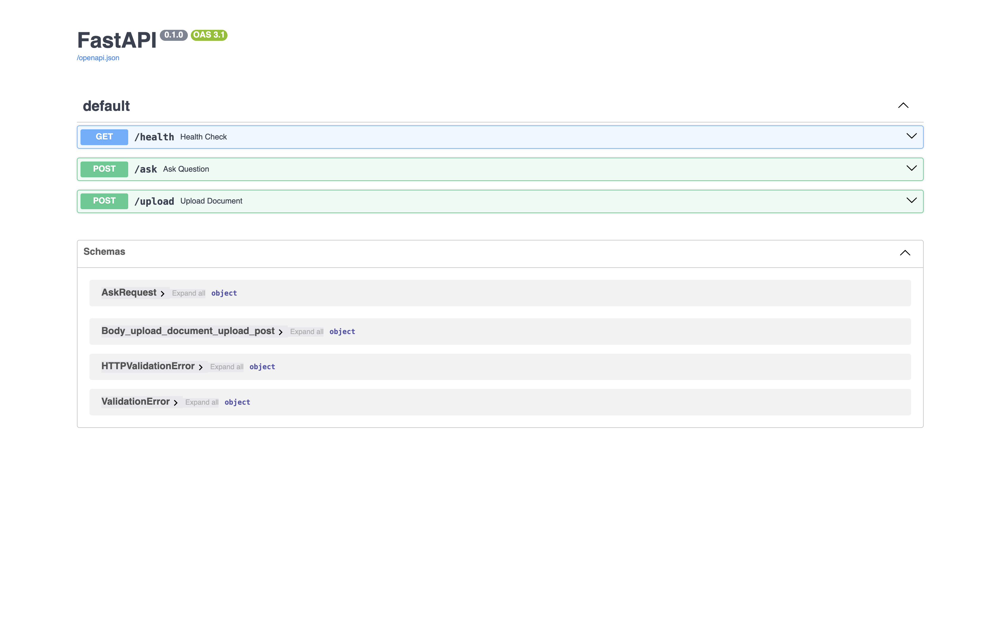
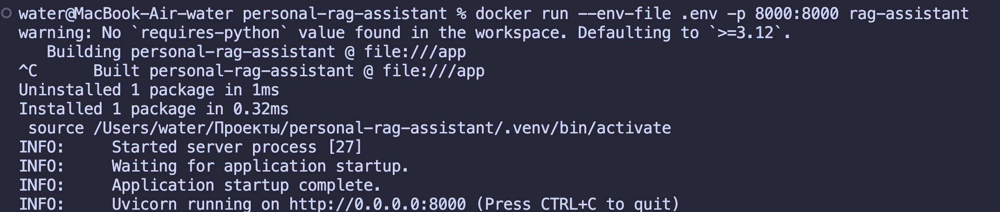
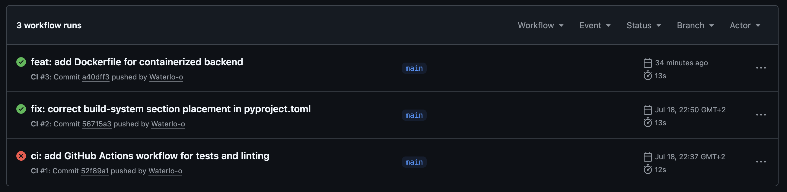

# Personal RAG Assistant

A learning pet project: a RAG (Retrieval-Augmented Generation) assistant that answers questions about personal documents, built from scratch in Python. Developed step by step as a hands-on AI engineering track — from a first LLM API call to a containerized backend with tool use and CI/CD.

**Stack:** Python 3.12 · FastAPI · Gemini API (`google-genai`) · NumPy · Docker · GitHub Actions

---

## What it does

1. The user uploads a text document.
2. The document is split into semantic chunks and converted into embeddings.
3. For each user question, the assistant retrieves the most relevant document fragments (retrieval) and passes them to the model together with the question (augmented generation).
4. The assistant answers strictly based on the document's content — it does not invent facts that aren't there.

The assistant can also decide on its own when to use document search as a tool (tool use / function calling), rather than always following a fixed pipeline.

## Screenshots & Demo

1. **User Interface**  
   Frontend home screen — minimalist design for seamless interaction.  
   

2. **Data Upload & Processing**  
   Uploading user documents followed by successful indexing into the vector database.  
   

3. **Smart Search (RAG)**  
   Real chat dialogue example: the system answers questions based on the uploaded context.  
   

4. **Interactive API Documentation**  
   Built-in Swagger UI (`/docs`) for easy exploration and testing of available endpoints.  
   

5. **Simple Deployment**  
   Single-command `docker run` setup alongside a successful Healthcheck status in the browser.  
   

6. **Reliability & Automation**  
   Passing Continuous Integration (CI) pipeline in GitHub Actions.  
   

## Architecture

```
Documents -> Chunking -> Embedding -> Vector Search -> LLM Generation -> Answer
                                            ^
                                      User Question
```

```
personal-rag-assistant/
├── src/rag_assistant/
│   ├── api.py              — FastAPI backend (/health, /ask, /upload)
│   ├── cli.py               — CLI interface, chat with history
│   ├── pipeline.py          — RAG pipeline, tool use (function calling)
│   ├── constants.py
│   ├── ingestion/
│   │   ├── loader.py        — document loading
│   │   └── chunker.py       — text chunking on sentence boundaries
│   └── retrieval/
│       └── embedder.py      — embeddings, cosine similarity, relevant chunk search
├── frontend/
│   └── front.html            — web interface (chat + document upload)
├── scripts/
│   └── evaluate.py          — manual evaluation on a question-answer set
├── tests/                    — pytest, with mocks for external API calls
├── data/                     — sample document for demo/evaluation
├── config/
│   └── system_prompt.txt
├── .github/workflows/ci.yml — automatic lint + tests on every push
├── Dockerfile
└── .dockerignore
```

## Key technical decisions

- **Manual chunking and cosine similarity** — implemented by hand with NumPy (not via off-the-shelf libraries like sentence-transformers), deliberately, to understand the mechanics of semantic search.
- **Tool use (function calling)** — implemented and explored in two variants: automatic (the SDK manages the function-call loop itself) and manual (full control over the request -> function call -> result -> final answer cycle), to understand what happens "under the hood" in both cases.
- **Evaluation** — a standalone script that checks answer quality against a set of questions with known answers, including deliberate "traps" (similarly-worded entities, questions with no answer in the document — to test for hallucinations).
- **Logging** — separate levels for console and file output, with third-party library noise filtered out.
- **CI/CD** — automatic `ruff` and `pytest` runs on GitHub Actions on every push.
- **Docker** — multi-layer build with separate caching for dependencies and code, for fast rebuilds.

## Running the project

### With Docker (recommended)

```bash
docker build -t rag-assistant .
docker run -e GEMINI_API_KEY=<your_key> -p 8000:8000 rag-assistant
```

Then, in a separate terminal, run the frontend:
```bash
cd frontend
python -m http.server 5500
```

Open `http://localhost:5500/front.html`.

### Locally, without Docker

```bash
uv sync
uv run uvicorn rag_assistant.api:app --reload
```

API docs (Swagger UI): `http://localhost:8000/docs`

### CLI version

```bash
uv run python src/rag_assistant/cli.py
```

## Testing

```bash
uv run pytest -v                     # unit tests, all external calls mocked
uv run python scripts/evaluate.py    # manual evaluation against the real API
```

## Known limitations (deliberate, not bugs)

- The backend keeps document state in process memory — it doesn't support multiple concurrent users with different documents (no per-session state).
- Query rewriting for multi-turn conversations isn't implemented — each question is treated as self-contained.
- The API endpoints (`/ask`, `/upload`) aren't yet covered by pytest tests (only manually tested via Swagger UI).

## Possible next steps

Session management for multiple users, a full agent loop with several sequential tool calls, and query rewriting for multi-turn conversations.